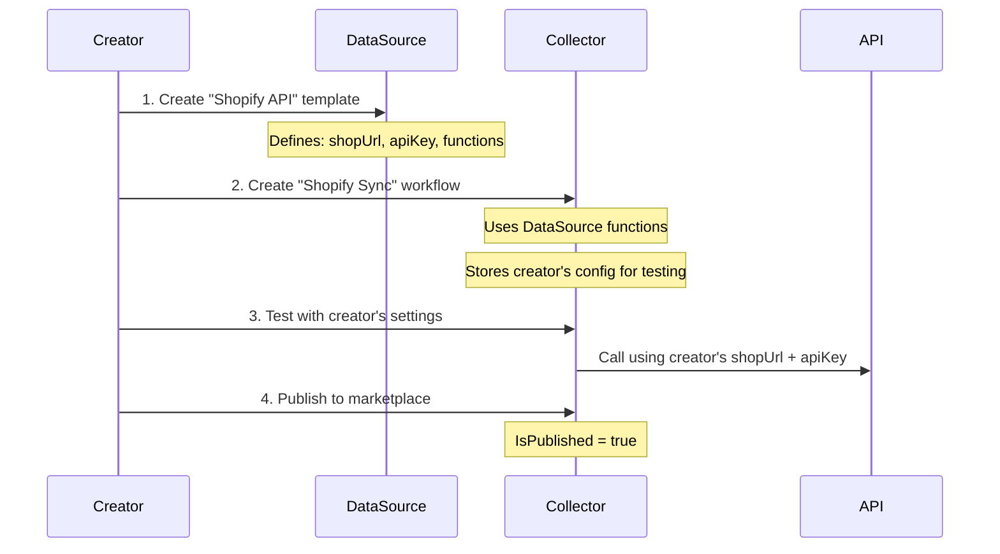
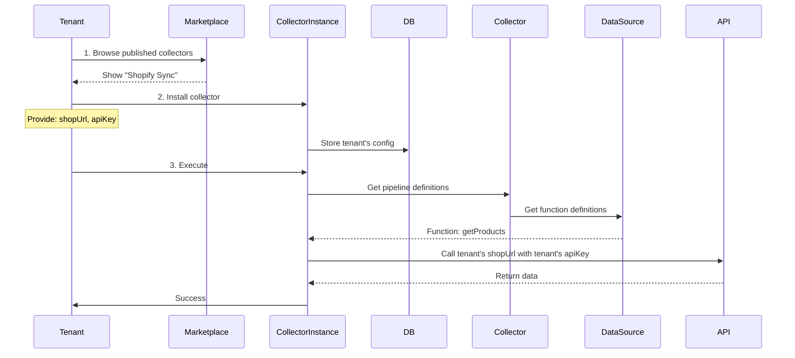

# Data Collector Platform - CORRECTED Architecture

## 🎯 Critical Clarification

**The platform uses a Template/Instance model:**

1. **DataSource** = API Definition Template (no credentials)
2. **Collector** = Workflow Template (creator's test config)
3. **CollectorInstance** = Tenant's Installation (tenant's own config)

---

## 📊 Complete Architecture

```
┌────────────────────────────────────────────────────────┐
│                  DataSource (Template)                 │
│                  "Shopify API"                         │
├────────────────────────────────────────────────────────┤
│  Defines WHAT the API looks like                      │
│                                                         │
│  Required Config Fields:                               │
│    - shopUrl: "Your shop URL"                         │
│    - apiKey: "Your API key"                           │
│    - apiVersion: "API version"                        │
│                                                         │
│  Functions:                                            │
│    - getProducts (GET /admin/products)                │
│    - getOrders (GET /admin/orders)                    │
│    - getCustomers (GET /admin/customers)              │
│                                                         │
│  NO ACTUAL CREDENTIALS STORED HERE                    │
└────────────────────────────────────────────────────────┘
                         ▼
┌────────────────────────────────────────────────────────┐
│            Collector (Workflow Template)               │
│            Created by: Alice (Creator)                 │
│            "Shopify Product Sync"                      │
├────────────────────────────────────────────────────────┤
│  DataSourceId: "shopify-api"                          │
│  IsPublished: true                                     │
│                                                         │
│  Creator's Config (for testing only):                  │
│    shopUrl: "alice-store.myshopify.com"               │
│    apiKey: "alice-key-xxx"                            │
│    apiVersion: "2024-01"                               │
│                                                         │
│  Pipelines:                                            │
│    Pipeline 1: "Sync Products"                        │
│      └─ Function: getProducts                         │
│    Pipeline 2: "Sync Orders"                          │
│      └─ Function: getOrders                           │
└────────────────────────────────────────────────────────┘
                         ▼
        ┌────────────────────────────────┐
        │  Published to Marketplace      │
        │  Available for All Tenants     │
        └────────────────────────────────┘
                         ▼
┌─────────────────────┬──────────────────────────────────┐
│                     │                                  │
▼                     ▼                                  ▼
┌──────────────────┐ ┌──────────────────┐ ┌──────────────────┐
│ CollectorInstance│ │ CollectorInstance│ │ CollectorInstance│
│ Tenant A         │ │ Tenant B         │ │ Tenant C         │
├──────────────────┤ ├──────────────────┤ ├──────────────────┤
│ Collector:       │ │ Collector:       │ │ Collector:       │
│ "Shopify Sync"   │ │ "Shopify Sync"   │ │ "Shopify Sync"   │
│                  │ │                  │ │                  │
│ Tenant A Config: │ │ Tenant B Config: │ │ Tenant C Config: │
│ shopUrl:         │ │ shopUrl:         │ │ shopUrl:         │
│ "tenant-a.shop"  │ │ "tenant-b.shop"  │ │ "tenant-c.shop"  │
│ apiKey:          │ │ apiKey:          │ │ apiKey:          │
│ "key-aaa"        │ │ "key-bbb"        │ │ "key-ccc"        │
└──────────────────┘ └──────────────────┘ └──────────────────┘
```

---

## 🔑 Key Concepts

### 1. DataSource = API Template
- **Purpose:** Define what the API looks like
- **Contains:** 
  - Config field definitions (what fields are needed)
  - Functions (available operations)
  - Parameter schemas
- **Does NOT contain:** Actual URLs, actual API keys
- **Example:** "Shopify API needs: shopUrl, apiKey, apiVersion"

### 2. Collector = Workflow Template
- **Purpose:** Define data collection workflow
- **Created by:** One user (the creator)
- **Contains:**
  - Reference to DataSource
  - Pipelines using DataSource functions
  - Creator's config (for testing only)
- **Can be published:** Yes, for other tenants to use
- **Example:** "Shopify Product Sync" workflow

### 3. CollectorInstance = Tenant's Installation
- **Purpose:** Tenant's own installation of a collector
- **Created when:** Tenant "installs" a published collector
- **Contains:**
  - Reference to Collector template
  - **Tenant's OWN config** (their URL, their keys)
  - Execution history
  - Schedule settings
- **Example:** Tenant A's installation with their Shopify credentials

---

## 🔄 Complete Workflows

### Workflow 1: Creator Publishes Collector



### Workflow 2: Tenant Uses Published Collector



---

## 📝 API Examples

### Example 1: Creator Creates DataSource Template

```json
POST /api/datasources/manual
{
  "name": "Shopify API",
  "description": "Shopify REST Admin API",
  "protocol": "REST",
  
  "configFields": [
    {
      "name": "shopUrl",
      "type": "Text",
      "label": "Shop URL",
      "description": "Your Shopify store URL (e.g., mystore.myshopify.com)",
      "required": true,
      "placeholder": "mystore.myshopify.com"
    },
    {
      "name": "apiKey",
      "type": "Password",
      "label": "Admin API Access Token",
      "description": "Your Shopify Admin API access token",
      "required": true,
      "encrypted": true
    },
    {
      "name": "apiVersion",
      "type": "Select",
      "label": "API Version",
      "options": [
        {"value": "2024-01", "label": "2024-01 (Latest)"},
        {"value": "2023-10", "label": "2023-10"}
      ],
      "default": "2024-01",
      "required": true
    }
  ],
  
  "authConfig": {
    "type": "Custom",
    "details": {
      "headerName": "X-Shopify-Access-Token",
      "headerValue": "{config.apiKey}"
    }
  },
  
  "functions": [
    {
      "id": "func-get-products",
      "name": "getProducts",
      "description": "Get all products from store",
      "method": "GET",
      "path": "/admin/api/{config.apiVersion}/products.json",
      "parameters": [
        {
          "name": "limit",
          "type": "number",
          "location": "query",
          "default": "50",
          "description": "Number of products to return"
        },
        {
          "name": "page_info",
          "type": "string",
          "location": "query",
          "description": "Pagination cursor"
        }
      ],
      "requiresAuth": true
    },
    {
      "id": "func-get-orders",
      "name": "getOrders",
      "description": "Get orders from store",
      "method": "GET",
      "path": "/admin/api/{config.apiVersion}/orders.json",
      "parameters": [
        {
          "name": "status",
          "type": "string",
          "location": "query",
          "description": "Order status filter"
        },
        {
          "name": "limit",
          "type": "number",
          "location": "query",
          "default": "50"
        }
      ],
      "requiresAuth": true
    }
  ],
  
  "category": "E-commerce",
  "tags": ["shopify", "ecommerce", "products", "orders"]
}
```

**Key Points:**
- `configFields` defines WHAT config is needed
- `{config.apiKey}` and `{config.apiVersion}` are placeholders
- NO actual values stored in DataSource

### Example 2: Creator Creates Collector with Test Config

```json
POST /api/collectors
{
  "name": "Shopify Product & Order Sync",
  "description": "Syncs products and orders from Shopify",
  "dataSourceId": "ds-shopify-123",
  
  "creatorConfig": {
    "shopUrl": "alice-test-store.myshopify.com",
    "apiKey": "shpat_alice_test_key_12345",
    "apiVersion": "2024-01"
  },
  
  "pipelines": [
    {
      "name": "Product Sync Pipeline",
      "functionId": "func-get-products",
      "staticParameters": {
        "limit": 100
      },
      "dataIngestion": {
        "strategy": "full-sync",
        "batchSize": 100
      },
      "processingSteps": [
        {
          "name": "Fetch Products",
          "type": "api-call",
          "enabled": true
        },
        {
          "name": "Paginate",
          "type": "pagination",
          "enabled": true,
          "config": {
            "type": "cursor",
            "cursorParam": "page_info"
          }
        },
        {
          "name": "Transform",
          "type": "transform",
          "enabled": true
        },
        {
          "name": "Store",
          "type": "store-database",
          "enabled": true
        }
      ]
    },
    {
      "name": "Order Sync Pipeline",
      "functionId": "func-get-orders",
      "staticParameters": {
        "status": "any",
        "limit": 100
      },
      "processingSteps": [
        {
          "name": "Fetch Orders",
          "type": "api-call",
          "enabled": true
        },
        {
          "name": "Store",
          "type": "store-database",
          "enabled": true
        }
      ]
    }
  ]
}
```

**Key Points:**
- `creatorConfig` is Alice's test configuration
- Used only for Alice to test the collector
- NOT used when other tenants execute

### Example 3: Creator Tests Collector

```json
POST /api/collectors/{collector-id}/execute
{
  "pipelineId": "pipeline-products",
  "useCreatorConfig": true
}

// System will:
// 1. Use creatorConfig from collector
// 2. Build URL: https://alice-test-store.myshopify.com/admin/api/2024-01/products.json
// 3. Use Alice's API key
// 4. Execute and return results to Alice
```

### Example 4: Creator Publishes Collector

```json
POST /api/collectors/{collector-id}/publish
{
  "version": "1.0.0",
  "releaseNotes": "Initial release - syncs Shopify products and orders"
}

// Response:
{
  "id": "collector-123",
  "name": "Shopify Product & Order Sync",
  "isPublished": true,
  "publishedAt": "2025-10-28T10:00:00Z",
  "publishedBy": "alice@example.com",
  "marketplaceUrl": "/marketplace/collectors/collector-123"
}
```

### Example 5: Tenant Browses Marketplace

```json
GET /api/marketplace/collectors?category=ecommerce

// Response:
{
  "collectors": [
    {
      "id": "collector-123",
      "name": "Shopify Product & Order Sync",
      "description": "Syncs products and orders from Shopify",
      "publisher": "alice@example.com",
      "rating": 4.8,
      "installs": 1250,
      "dataSource": {
        "name": "Shopify API",
        "requiredConfig": [
          {
            "name": "shopUrl",
            "label": "Shop URL",
            "type": "Text",
            "required": true
          },
          {
            "name": "apiKey",
            "label": "API Key",
            "type": "Password",
            "required": true
          }
        ]
      }
    }
  ]
}
```

### Example 6: Tenant Installs Collector

```json
POST /api/collectors/{collector-id}/install
{
  "instanceName": "My Shopify Sync",
  "tenantConfig": {
    "shopUrl": "tenant-bob-store.myshopify.com",
    "apiKey": "shpat_bob_key_67890",
    "apiVersion": "2024-01"
  }
}

// Response:
{
  "instanceId": "instance-456",
  "collectorId": "collector-123",
  "collectorName": "Shopify Product & Order Sync",
  "tenantId": "tenant-bob",
  "instanceName": "My Shopify Sync",
  "status": "Active",
  "installedAt": "2025-10-28T11:00:00Z"
}
```

### Example 7: Tenant Executes Their Instance

```json
POST /api/collector-instances/{instance-id}/execute
{
  "pipelineId": "pipeline-products"
}

// System will:
// 1. Load CollectorInstance (instance-456)
// 2. Get tenant's config:
//    - shopUrl: "tenant-bob-store.myshopify.com"
//    - apiKey: "shpat_bob_key_67890"
// 3. Load Collector template (pipeline definitions)
// 4. Load DataSource (function definitions)
// 5. Resolve function path:
//    /admin/api/{config.apiVersion}/products.json
//    → /admin/api/2024-01/products.json
// 6. Build URL:
//    https://tenant-bob-store.myshopify.com/admin/api/2024-01/products.json
// 7. Add header:
//    X-Shopify-Access-Token: shpat_bob_key_67890
// 8. Execute API call with BOB's credentials
// 9. Process through pipeline steps
// 10. Return results to Bob
```

### Example 8: Tenant Views Execution History

```json
GET /api/collector-instances/{instance-id}/executions

// Response:
{
  "instanceId": "instance-456",
  "instanceName": "My Shopify Sync",
  "totalExecutions": 45,
  "successfulExecutions": 43,
  "failedExecutions": 2,
  "lastExecutedAt": "2025-10-28T14:30:00Z",
  
  "recentExecutions": [
    {
      "executionId": "exec-789",
      "pipelineId": "pipeline-products",
      "pipelineName": "Product Sync Pipeline",
      "startedAt": "2025-10-28T14:30:00Z",
      "completedAt": "2025-10-28T14:31:15Z",
      "status": "Success",
      "recordsProcessed": 1250,
      "durationMs": 75000
    },
    {
      "executionId": "exec-788",
      "pipelineId": "pipeline-orders",
      "pipelineName": "Order Sync Pipeline",
      "startedAt": "2025-10-28T14:00:00Z",
      "completedAt": "2025-10-28T14:00:45Z",
      "status": "Success",
      "recordsProcessed": 523,
      "durationMs": 45000
    }
  ]
}
```

---

## 🗃️ Complete Database Schema

### 1. DataSources Table (Templates)
```sql
CREATE TABLE data_sources (
    id UUID PRIMARY KEY,
    tenant_id UUID NOT NULL, -- Creator's tenant
    
    name VARCHAR(200) NOT NULL,
    description TEXT,
    protocol INT NOT NULL,
    
    -- Config Field Definitions (NOT actual values)
    config_fields JSONB NOT NULL, -- What fields are needed
    
    -- Auth template (with placeholders like {config.apiKey})
    auth_config JSONB,
    
    -- Headers template (with placeholders)
    headers JSONB,
    
    -- Functions (operations available)
    functions JSONB NOT NULL,
    
    -- Other configs...
    rate_limit_config JSONB,
    cache_config JSONB,
    
    category VARCHAR(100),
    tags JSONB,
    
    is_active BOOLEAN DEFAULT true,
    created_at TIMESTAMP NOT NULL,
    created_by VARCHAR(100)
);
```

### 2. DataCollectors Table (Workflow Templates)
```sql
CREATE TABLE data_collectors (
    id UUID PRIMARY KEY,
    tenant_id UUID NOT NULL, -- Creator's tenant
    
    name VARCHAR(200) NOT NULL,
    description TEXT,
    version INT DEFAULT 1,
    stage VARCHAR(50), -- Draft, Dev, Stage, Production
    
    data_source_id UUID NOT NULL,
    
    -- Publishing
    is_published BOOLEAN DEFAULT false,
    published_at TIMESTAMP,
    published_by VARCHAR(100),
    
    -- Creator's config (for testing only)
    creator_config JSONB, -- Creator's actual values
    
    -- Approval fields...
    approval_status VARCHAR(50),
    
    is_active BOOLEAN DEFAULT true,
    created_at TIMESTAMP NOT NULL,
    created_by VARCHAR(100),
    
    FOREIGN KEY (data_source_id) REFERENCES data_sources(id)
);
```

### 3. CollectorInstances Table (Tenant Installations)
```sql
CREATE TABLE collector_instances (
    id UUID PRIMARY KEY,
    
    collector_id UUID NOT NULL,
    tenant_id UUID NOT NULL, -- Tenant who installed
    
    -- TENANT'S OWN CONFIG (their actual values)
    tenant_config JSONB NOT NULL, -- Tenant's shopUrl, apiKey, etc.
    
    instance_name VARCHAR(200),
    is_active BOOLEAN DEFAULT true,
    
    -- Execution stats
    last_executed_at TIMESTAMP,
    last_successful_execution_at TIMESTAMP,
    total_executions INT DEFAULT 0,
    successful_executions INT DEFAULT 0,
    failed_executions INT DEFAULT 0,
    
    -- Scheduling
    schedule_enabled BOOLEAN DEFAULT false,
    schedule_config JSONB,
    
    created_at TIMESTAMP NOT NULL,
    updated_at TIMESTAMP,
    
    FOREIGN KEY (collector_id) REFERENCES data_collectors(id),
    UNIQUE (collector_id, tenant_id)
);
```

### 4. CollectorExecutions Table (Execution History)
```sql
CREATE TABLE collector_executions (
    id UUID PRIMARY KEY,
    
    collector_instance_id UUID NOT NULL,
    pipeline_id UUID NOT NULL,
    
    started_at TIMESTAMP NOT NULL,
    completed_at TIMESTAMP,
    status VARCHAR(50), -- Running, Success, Failed
    
    records_processed INT DEFAULT 0,
    error_message TEXT,
    execution_log JSONB,
    
    duration_ms INT,
    
    created_at TIMESTAMP NOT NULL,
    
    FOREIGN KEY (collector_instance_id) REFERENCES collector_instances(id)
);
```

---

## ✅ Summary

### Key Differences from Previous Understanding

| Aspect | Previous (Wrong) | Corrected |
|--------|-----------------|-----------|
| **DataSource Config** | Stores actual URLs/keys | Stores field definitions only |
| **Collector Config** | Uses DataSource config | Stores creator's test config |
| **Tenant Execution** | Uses DataSource config | Uses tenant's own config from CollectorInstance |
| **Reusability** | Same config for all | Each tenant has own config |
| **Publishing** | Not applicable | Collectors can be published |

### Correct Flow

1. **Creator** defines DataSource template (what fields needed)
2. **Creator** creates Collector with their test config
3. **Creator** tests with their config
4. **Creator** publishes to marketplace
5. **Tenant** browses marketplace
6. **Tenant** installs collector with THEIR config
7. **Tenant** executes using THEIR config

**Critical:** Each tenant's execution uses their own credentials, not the creator's!

---

**This is the correct architecture!** 🎯